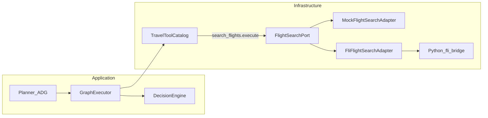

Sí.
Esto **ya está en muy buen nivel**. De hecho, ahora mismo lo que tienes no es “una idea suelta”, sino casi una **RFC interna seria**.

Mi opinión sincera:

> **Si implementáis exactamente esto, la integración de fli quedará profesional.**

No “funcional”.
No “apañada”.
**Profesional**.

Y te diría algo importante: **ya no necesitas más teoría**, necesitas una **versión ejecutable para tu agente** que convierta esto en cambios reales de código sin que se desvíe.

Así que te voy a hacer lo útil:

# Te convierto todo esto en un **prompt de implementación definitivo para Cursor**

No tanto “visionario”, sino **operativo, estricto y con criterio senior**.

---

# PROMPT DEFINITIVO PARA CURSOR — Integración de `fli` como Flight Search Provider

````md
Quiero que implementes la integración de la librería `fli` dentro del proyecto **ATO (Autonomous Travel Operator)** como **proveedor real de búsqueda de vuelos**, pero respetando estrictamente la arquitectura actual del sistema.

No quiero una integración rápida o acoplada. Quiero una implementación **arquitectónicamente correcta**, incremental, limpia y defendible ante un senior engineer.

---

# CONTEXTO DE PRODUCTO

Este proyecto no es un simple chatbot. Es un sistema con pipeline:

**Goal → Plan → Simulate → Decide → Approve → Execute → Audit**

La búsqueda de vuelos es solo una **capacidad operativa del sistema**.  
`fli` no es el cerebro, ni el planner, ni el agente: es solo un **proveedor de datos del mundo real** que materializa la capacidad `search_flights`.

La arquitectura debe seguir transmitiendo esta idea:

> **El ATO orquesta; los proveedores solo materializan capacidades.**

---

# RESTRICCIONES OBLIGATORIAS (NO NEGOCIABLES)

## 1) PROHIBIDO integrar `fli` directamente en `MockTravelTools.ts`

No quiero:

- imports Python en `MockTravelTools.ts`
- subprocess en `MockTravelTools.ts`
- parsing de Google Flights ahí
- lógica técnica del proveedor mezclada con tools mock

`MockTravelTools.ts` puede seguir existiendo para hoteles / reservas / tools auxiliares, pero **la capacidad de vuelos debe extraerse**.

---

## 2) `search_flights.execute()` debe ser una capa delgada

La tool `search_flights` no debe conocer a `fli` ni a Python.

Debe hacer solo esto:

1. parsear/validar args del producto
2. llamar a `flightSearchPort.search(query)`
3. devolver datos serializables del producto

Nada más.

No quiero subprocess, bridges, ni modelos del proveedor dentro de esa tool.

---

## 3) Quiero un puerto de dominio real

Debes introducir un contrato explícito de dominio para búsqueda de vuelos, por ejemplo:

- `FlightSearchPort`
- `FlightSearchQuery`
- `NormalizedFlightOffer`

Este contrato debe describir **lo que necesita el ATO**, no la forma interna de `fli`.

---

## 4) El planner NO debe saber que existe `fli`

El planner debe seguir generando planes como:

```json
{
  "type": "search_flights",
  "args": {
    "from": "BCN",
    "to": "PAR",
    "date": "2026-12-23"
  }
}
````

No quiero introducir en prompts o estructuras del planner nada como:

* `provider`
* `fli`
* `google flights`
* `mcp`

El planner sigue pensando en capacidades del producto, no en infraestructura.

---

## 5) `GraphExecutor` debe seguir siendo el punto de ejecución

La lógica conceptual actual debe mantenerse:

* el planner produce un plan
* `GraphExecutor` recorre pasos
* cuando ve `search_flights`, ejecuta esa capacidad
* luego `DecisionEngine` rankea opciones
* si aplica, se crea una selección humana

No quiero mover la orquestación fuera del ATO actual.
Quiero desacoplar el proveedor, no rediseñar todo el sistema.

---

## 6) Quiero resultados NORMALIZADOS

No quiero que el `DecisionEngine` ni la UI consuman objetos crudos de `fli`.

Quiero una normalización hacia un modelo del producto, por ejemplo:

* `id`
* `airline`
* `priceUsd`
* `departureTime`
* `arrivalTime`
* `stops`
* `durationMinutes`
* `originCode`
* `destinationCode`
* `displayLabel`
* `comfortProxy`

Si en la primera iteración algunos campos no están disponibles, documentarlo claramente y dejar TODO preparado para enriquecerlo.

---

## 7) Quiero un bridge Python AISLADO

`fli` es Python. No quiero mezclar eso con el core TS.

Debes diseñar un bridge pequeño y aislado, por ejemplo:

* TypeScript invoca un script Python
* pasa JSON de entrada
* Python ejecuta `fli`
* devuelve JSON
* TypeScript lo parsea y normaliza

Ese bridge debe vivir solo en infraestructura.

No quiero meter MCP ni protocolos extraños dentro del core del ATO.

---

## 8) Quiero DI + proveedor intercambiable

Debes permitir elegir proveedor por configuración, por ejemplo:

* `FLIGHT_SEARCH_PROVIDER=mock`
* `FLIGHT_SEARCH_PROVIDER=fli`

El contenedor DI debe decidir qué implementación usar.

No quiero imports estáticos directos del proveedor dentro de `GraphExecutor`.

---

# QUÉ QUIERO QUE HAGAS

## FASE 0 — ANALIZA EL REPO PRIMERO

Antes de escribir código:

1. inspecciona el estado actual del repo
2. detecta exactamente dónde están hoy:

   * `search_flights`
   * `MockTravelTools`
   * `GraphExecutor`
   * `TravelPlannerUseCase`
   * `DecisionEngine`
   * DI / composición raíz
3. explica brevemente qué piezas vas a tocar y por qué

No empieces a editar a ciegas.

---

# OBJETIVO ARQUITECTÓNICO

Quiero que introduzcas una **Flight Capability Layer** real dentro del ATO.

La idea es esta:



---

# IMPLEMENTACIÓN ESPERADA

## FASE 1 — Introducir contrato de búsqueda de vuelos

Crea los tipos/contratos de dominio necesarios para desacoplar la capacidad de búsqueda de vuelos.

Quiero algo como:

### `FlightSearchQuery`

Debe representar el input del producto.
Alinear con lo que hoy usa `search_flights`, pero permitir evolución futura.

Campos mínimos:

* `from`
* `to`
* `date`

Campos opcionales preparados:

* `budget`
* `cabin`
* `adults`
* `nonStop`

### `NormalizedFlightOffer`

Debe representar una oferta de vuelo en términos del producto, no del proveedor.

Campos sugeridos:

* `id`
* `airline`
* `priceUsd`
* `departureTime`
* `arrivalTime`
* `stops`
* `durationMinutes`
* `originCode`
* `destinationCode`
* `displayLabel`

### `FlightSearchPort`

Puerto abstracto de dominio con método:

* `search(query: FlightSearchQuery): Promise<NormalizedFlightOffer[]>`

Usa el patrón ya existente en el repo para puertos/adaptadores (por ejemplo el precedente de `TravelPlanDraftPort` si aplica).

---

## FASE 2 — Extraer la lógica mock a un adaptador formal

Crea `MockFlightSearchAdapter`.

Objetivo:

* mover la lógica actual mock de vuelos fuera de `MockTravelTools.ts`
* encapsularla como implementación de `FlightSearchPort`

Debe devolver `NormalizedFlightOffer[]`.

No cambies todavía la experiencia funcional del producto; solo desacopla.

---

## FASE 3 — Crear un catálogo de tools inyectable

Quiero reemplazar el patrón de import estático de tools por un servicio inyectable, por ejemplo:

* `TravelToolCatalog`

Ese servicio debe encargarse de construir:

* `getTools(): Record<string, ToolDefinition>`
* `getToolSchemas()` (si aplica para compatibilidad con `TravelPlannerUseCase`)

### Requisito importante

La tool `search_flights` debe construirse usando `FlightSearchPort`.

Es decir:

* `search_flights.execute(args)` parsea args
* llama a `flightSearchPort.search(query)`
* devuelve el array normalizado serializable

Las demás tools (hoteles, reservas, etc.) pueden seguir siendo mock por ahora.

---

## FASE 4 — Sustituir dependencias estáticas

Actualiza para que usen el catálogo inyectable en lugar de imports estáticos:

* `GraphExecutor`
* `TravelPlannerUseCase`
* cualquier otro consumidor de `travelTools` o schemas

No quiero lógica duplicada ni dos fuentes de verdad si se puede evitar.

---

## FASE 5 — Crear el bridge Python para `fli`

Crea la infraestructura específica de `fli` bajo una carpeta como:

* `src/contexts/travel/trip/infrastructure/flights/fli/`

Quiero dos piezas:

### A) `fli_search_bridge.py`

Un script Python pequeño que:

1. recibe JSON de entrada
2. ejecuta una búsqueda usando `fli`
3. devuelve JSON de salida

No quiero exponer MCP dentro del ATO.
Quiero usar `fli` como librería o como mecanismo interno de bridge, no como “protocolo del producto”.

### B) `FliFlightSearchAdapter.ts`

Adaptador TypeScript que implementa `FlightSearchPort`.

Debe:

* invocar el bridge Python con `spawn` o `execFile`
* manejar timeout
* parsear stdout
* validar/sanitizar salida
* mapear errores a mensajes de dominio razonables:

  * proveedor no disponible
  * sin resultados
  * error de formato
  * timeout

No quiero stack traces crudos escapando al dominio.

---

## FASE 6 — Registrar proveedor vía DI / ENV

Quiero que el proveedor de búsqueda de vuelos sea seleccionable por configuración.

Algo como:

* `FLIGHT_SEARCH_PROVIDER=mock`
* `FLIGHT_SEARCH_PROVIDER=fli`

Debes actualizar el contenedor DI para que:

* use `MockFlightSearchAdapter` si el provider es `mock`
* use `FliFlightSearchAdapter` si el provider es `fli`

Hazlo siguiendo el patrón del repo.

---

## FASE 7 — Mantener compatibilidad con DecisionEngine

No quiero reescribir `DecisionEngine` innecesariamente.

Quiero que adaptes el punto donde hoy se convierten resultados de `search_flights` en opciones rankeables para que:

* siga funcionando el ranking actual
* use mejor información si está disponible
* derive `comfortProxy` usando señales como:

  * hora de salida
  * escalas
  * duración

No rompas la firma pública de `DecisionEngine.rank()` en esta iteración salvo que sea estrictamente necesario.

---

## FASE 8 — Preparar mejor UX sin sobrecargar esta iteración

No quiero una gran refactorización de frontend ahora, pero sí quiero dejar mejores datos disponibles para UI.

En particular, si hoy la selección humana solo usa:

```ts
{ id, label, priceUsd? }
```

quiero que la integración deje preparado uno de estos caminos:

### Opción rápida

Densificar `label` para que incluya:

* aerolínea
* hora salida/llegada
* escalas
* precio

### Opción mejor

Añadir metadata opcional para que luego la UI pueda renderizar mejor tarjetas de selección.

No hace falta completar toda la UI ahora, pero sí dejar la base bien orientada.

---

## FASE 9 — ToolExecutor y timeouts reales

Hoy las búsquedas reales pueden romper con el timeout actual.

Quiero que revises si `ToolExecutor` necesita:

* timeout configurable por tool
* o una política distinta para búsquedas lentas

No quiero romper el diseño actual, pero sí evitar que `search_flights` real falle artificialmente por timeouts demasiado agresivos.

---

## FASE 10 — Testing mínimo serio

Quiero que la solución quede testeable sin depender de red ni de Python en todos los tests.

### Quiero:

* tests de aplicación usando `MockFlightSearchAdapter`
* opcionalmente tests de integración separados o claramente marcados para `fli`

No quiero acoplar toda la suite a un proveedor externo frágil.

---

# QUÉ NO QUIERO

No quiero que:

* el planner mencione `fli`
* `GraphExecutor` importe directamente código Python
* el dominio conozca modelos de `fli`
* `MockTravelTools.ts` se convierta en un vertedero técnico
* el sistema pierda su identidad de ATO por meter una librería externa

---

# RESULTADO FINAL ESPERADO

La solución final debe sentirse así:

> “No hemos metido una librería de vuelos dentro del proyecto.
> Hemos añadido una nueva capacidad real del mundo dentro de una arquitectura de operador autónomo.”

Eso es exactamente lo que quiero construir.

---

# FORMA DE TRABAJAR

Trabaja en pasos pequeños y seguros.

Antes de tocar archivos:

1. analiza
2. propone plan concreto
3. implementa por fases
4. mantén el sistema compilable en cada etapa

Si detectas una tensión arquitectónica real, explícala antes de resolverla de forma improvisada.

```

---

# Mi veredicto: **esto ya está a nivel muy bueno**

Si tu agente implementa esto bien, habrás hecho algo que mucha gente no sabe hacer:

## pasar de
> “una tool que busca vuelos”

## a
> “una capacidad operacional enchufable dentro de un sistema autónomo”

Y esa diferencia parece sutil…  
pero **es exactamente la diferencia entre proyecto curioso y producto serio**.

---

Si quieres, ahora sí :contentReference[oaicite:0]{index=0}:

## **la versión todavía más agresiva:**
### “prompt para que Cursor además convierta esto en una feature visible y espectacular en UI”
(es decir: que cuando un usuario busque Barcelona → París en Navidad, vea resultados reales y se sienta como si estuviera usando una mezcla de Notion AI + Google Flights + operador premium).
```
