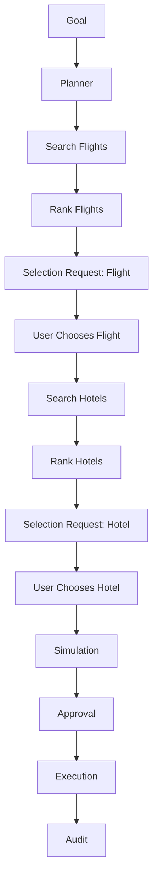

Tu agente aquí está **muy acertado**.
Y de hecho, esta distinción es **importantísima**, porque cambia por completo **qué tipo de producto estás construyendo**.

La respuesta corta es:

> **Sí: ahora mismo NO tienes un “tool-calling agent” en tiempo real.**
> Tienes algo más interesante:
> **un planner LLM + un execution engine determinista**.

Y eso, sinceramente, **es mejor para lo que quieres construir**.

---

# 🧠 Lo que realmente tienes hoy

Tu sistema actual funciona así:

## 1. El usuario escribe algo

> “Quiero ir de Barcelona a París en Navidad”

## 2. El LLM no llama tools

El modelo **no hace function calling real**.

No hace esto:

* `tool_calls`
* `tool_choice: "auto"`
* “llamo a search_flights ahora”

En vez de eso, hace esto:

> genera un **plan estructurado en JSON**

Por ejemplo, conceptualmente:

```json id="o7g9ko"
{
  "plan": [
    { "type": "search_flights", "args": {...} },
    { "type": "search_hotels", "args": {...} }
  ]
}
```

---

## 3. Tu backend interpreta ese plan

Y ahí entra el sistema de verdad:

* `GraphExecutor`
* `MockTravelTools`
* `executeWithResilience`

👉 o sea: **el sistema ejecuta**, no el LLM

---

# ⚡ Esto es MUY bueno (y te explico por qué)

Muchísima gente construye agentes así:

> usuario → LLM → tool call → tool call → tool call → respuesta

Eso parece “más mágico”, pero en realidad tiene varios problemas:

* menos control
* más impredecible
* peor auditabilidad
* peor UX para flujos por etapas
* más difícil meter approvals y branching

---

# 🚀 Tu enfoque es mejor para un producto serio

Tú estás construyendo esto:

> **el LLM propone**
> **el sistema decide y ejecuta**

Eso es muchísimo más sólido para un ATO.

---

# 🧩 Entonces, ¿qué implica esto para el flujo interactivo que quieres?

Esto es la parte importante:

## ❌ NO quieres que el LLM improvise cada tool call en caliente

Porque entonces el flujo tipo:

* mostrar 3 vuelos
* dejar elegir
* luego mostrar 3 hoteles
* luego decidir

...se vuelve más difícil de controlar.

---

## ✅ Sí quieres esto:

### Etapa 1

El LLM genera un plan inicial:

```txt id="llprji"
1. Buscar vuelos
2. Esperar elección del usuario
3. Buscar hoteles
4. Esperar elección del usuario
5. Simular coste total
6. Preparar reserva
```

### Etapa 2

El **GraphExecutor** ejecuta solo lo que toca ahora:

* busca vuelos
* devuelve 3 opciones
* se detiene

### Etapa 3

El usuario elige un vuelo

### Etapa 4

Tu sistema reanuda el grafo:

* ahora ejecuta búsqueda de hoteles
* devuelve 3 opciones
* se detiene otra vez

👉 **esto es exactamente el tipo de sistema que quieres**

---

# 🔥 La idea fuerte: “interactive checkpoints”

Lo que necesitas no es “más tool calling”.

Lo que necesitas es introducir:

> **checkpoints interactivos en el grafo**

---

# 🧠 Nuevo tipo de nodo que te falta

Ahora mismo tienes nodos tipo:

* `plan_step`
* `simulation`
* `decision`
* `approval`
* `execution`

Pero para hacer el flujo por etapas bien, necesitas además:

## 🟡 `selection`

Ejemplo:

```json id="9v73x7"
{
  "type": "selection",
  "status": "pending",
  "input": {
    "kind": "flight_choice",
    "options": [
      { "id": "flight_1", "price": 120 },
      { "id": "flight_2", "price": 180 },
      { "id": "flight_3", "price": 240 }
    ]
  }
}
```

---

# 💥 Esto cambia todo

Porque ahora el grafo ya puede representar:

## Fase 1 — vuelos

```txt id="4n3hjv"
goal
  ↓
search_flights
  ↓
decision (rank flights)
  ↓
selection (choose flight)  ← STOP
```

---

## Fase 2 — hoteles

Cuando el usuario elige:

```txt id="udv4k4"
selection (flight chosen)
  ↓
search_hotels
  ↓
decision (rank hotels)
  ↓
selection (choose hotel)   ← STOP
```

---

## Fase 3 — cierre

```txt id="a2u5l4"
selection (hotel chosen)
  ↓
simulation
  ↓
approval
  ↓
execution
```

---

# 🎯 Esto es MUCHO mejor que hacer todo de golpe

Porque ahora sí puedes construir la UX que imaginabas:

## Usuario

> “Quiero ir a París desde Barcelona”

## Sistema

> “He encontrado 3 vuelos, elige uno”

## Usuario

> “El segundo”

## Sistema

> “Perfecto. Ahora te muestro 3 hoteles dentro de tu presupuesto”

👉 eso ya se siente como **producto real**

---

# 🧭 Conclusión importante

Tu agente tiene razón en una cosa crítica:

> **hoy el LLM no está ejecutando tools**
> **tu servidor está ejecutando el plan**

Y eso **no es una limitación**.

Eso es precisamente lo que te permite construir:

* flujo por etapas
* opciones visibles
* selección explícita del usuario
* branching
* approvals reales
* execution engine serio

---

# 💬 Mi recomendación fuerte

Tu siguiente evolución NO debería ser:

> “hacer que el modelo use function calling real”

Tu siguiente evolución debería ser:

> **convertir tu ATO en un sistema interactivo basado en nodos `selection` y `resume` del grafo**

Sí. **Este es el siguiente salto importante de tu ATO**.

No necesitas “más agente”.
Necesitas **más estructura interactiva**.

Lo que vamos a diseñar ahora es el modelo conceptual para que tu sistema pase de:

> “te doy un plan y ejecuto cosas”

a:

> “te acompaño paso a paso, te presento opciones, espero tu decisión, y continúo”

Eso ya no es un chatbot.
Eso empieza a parecer un **operador autónomo real**.

---

# Visión: de planner lineal a **Interactive Decision Graph**

La idea central es esta:

> el sistema **no debe resolver todo de golpe**
> sino **avanzar por etapas**, deteniéndose en puntos donde el usuario debe decidir.

Eso significa que el grafo no solo representa ejecución.
También representa **espera humana**.

---

# 1) El cambio mental más importante

Hoy tu flujo conceptual es algo así:

```txt
Goal → Plan → Simulation → Approval → Execution → Decision → Audit
```

Pero para la UX que quieres, el flujo real debería parecerse más a esto:

```txt
Goal
  ↓
Plan
  ↓
Search flights
  ↓
Rank flights
  ↓
WAIT FOR USER CHOICE
  ↓
Search hotels
  ↓
Rank hotels
  ↓
WAIT FOR USER CHOICE
  ↓
Simulate itinerary
  ↓
Approval
  ↓
Execution
  ↓
Audit
```

Eso implica una cosa clave:

> **el usuario se convierte en actor del grafo**
> no solo en alguien que manda un prompt inicial.

---

# 2) Nuevos tipos de nodo que te faltan

Ahora mismo, conceptualmente, ya tienes algo parecido a:

* `goal`
* `plan_step`
* `simulation`
* `decision`
* `approval`
* `execution`
* `audit`

Pero para soportar un flujo interactivo de verdad, necesitas **al menos 3 tipos nuevos**:

---

## A. `selection_request`

Este nodo representa:

> “el sistema necesita que el usuario elija entre alternativas”

Ejemplo conceptual:

```json id="1wpr3a"
{
  "type": "selection_request",
  "status": "pending",
  "payload": {
    "selectionKind": "flight",
    "title": "Choose your outbound flight",
    "options": [
      { "id": "flight_1", "label": "Vueling 08:30 → 10:15", "priceUsd": 120 },
      { "id": "flight_2", "label": "Ryanair 12:00 → 13:50", "priceUsd": 95 },
      { "id": "flight_3", "label": "Iberia 18:10 → 20:00", "priceUsd": 150 }
    ]
  }
}
```

Este nodo **no ejecuta nada**.
Solo pausa el sistema y pide input.

---

## B. `selection_result`

Este nodo representa:

> “el usuario ya eligió una opción”

Ejemplo:

```json id="5fqztd"
{
  "type": "selection_result",
  "status": "completed",
  "payload": {
    "selectionKind": "flight",
    "selectedOptionId": "flight_2"
  }
}
```

Este nodo desbloquea el siguiente tramo del grafo.

---

## C. `resume_trigger`

Este nodo representa:

> “se puede reanudar la ejecución desde aquí”

No siempre hace falta modelarlo explícitamente como nodo físico si ya lo expresas con estado, pero conceptualmente es útil.

Sirve para decir:

* “ya se recibió input humano”
* “ya se puede continuar”
* “reanuda downstream”

---

# 3) Los nuevos estados del grafo

Hoy seguramente piensas en estados tipo:

* `pending`
* `completed`
* `failed`
* `blocked`

Pero ahora necesitas hacerlos más expresivos.

Yo te recomendaría este set conceptual:

```txt
pending
ready
running
waiting_user
waiting_approval
completed
failed
cancelled
skipped
```

---

## Qué significan

### `pending`

Existe, pero aún no se puede ejecutar porque depende de otros nodos.

### `ready`

Ya tiene todas las dependencias resueltas y puede ejecutarse.

### `running`

Está siendo procesado por el executor.

### `waiting_user`

Está pausado esperando una decisión del usuario.

### `waiting_approval`

Está pausado esperando aprobación de política.

### `completed`

Ya terminó correctamente.

### `failed`

Falló.

### `cancelled`

Se abortó explícitamente.

### `skipped`

Se omitió porque otra rama fue elegida.

---

# 4) Cómo debe pensar ahora tu GraphExecutor

Este es el cambio más importante de arquitectura.

Antes, el executor era algo así:

> “recorro steps y ejecuto si toca”

Ahora debe convertirse en esto:

> “recorro nodos ejecutables, y me detengo cuando el flujo requiere interacción”

---

## Nueva responsabilidad del `GraphExecutor`

Tu executor debe ser capaz de:

1. listar nodos `ready`
2. comprobar dependencias
3. detectar si un nodo requiere:

   * ejecución automática
   * aprobación
   * input humano
4. ejecutar solo lo que pueda
5. pausar el resto
6. devolver el nuevo estado del grafo a la UI

---

# 5) El patrón correcto: **run until wait**

Este patrón es buenísimo para tu producto.

En vez de “ejecuta todo”, tu motor debe hacer:

> **ejecuta hasta que llegues a un punto de espera**

Ese punto de espera puede ser:

* una selección del usuario
* una aprobación
* un error
* fin del flujo

---

## Pseudoflujo conceptual

```txt
GraphExecutor.runUntilWait(sessionId)

1. buscar nodos ready
2. si no hay ninguno → terminar
3. tomar siguiente nodo
4. si es auto → ejecutar
5. si requiere approval → marcar waiting_approval y parar
6. si requiere user selection → crear selection_request y parar
7. repetir
```

Ese patrón es oro.

Porque hace que tu backend funcione como un **workflow engine real**.

---

# 6) El flujo ideal para BCN → París

Ahora sí, diseñémoslo bien.

---

## Paso 0 — Goal

Usuario escribe:

> “Quiero ir a París desde Barcelona en Navidad”

El sistema crea:

```txt
goal node
```

---

## Paso 1 — Plan

El planner genera algo como:

```txt
1. Search outbound flights
2. Ask user to choose outbound flight
3. Search hotels
4. Ask user to choose hotel
5. Simulate total trip
6. Ask approval if needed
7. Execute reservation
```

No hace falta que el LLM decida tools en tiempo real.
Solo que genere bien el **esqueleto de interacción**.

---

# 7) Tramo de vuelos

## Nodo 1 — `search_flights`

El executor lo ejecuta automáticamente.

Salida conceptual:

```json id="zft0rp"
[
  { "id": "f1", "airline": "Vueling", "priceUsd": 120, "depart": "08:30" },
  { "id": "f2", "airline": "Ryanair", "priceUsd": 95, "depart": "12:00" },
  { "id": "f3", "airline": "Iberia", "priceUsd": 150, "depart": "18:10" }
]
```

---

## Nodo 2 — `decision_flights`

El sistema rankea esas opciones según:

* precio
* horario
* duración
* preferencias del usuario

Esto sigue siendo backend puro.
No necesitas meter al LLM aquí si no quieres.

---

## Nodo 3 — `selection_request: flight`

Ahora el sistema crea un nodo de espera:

```txt
Choose one of these 3 flights
```

Y aquí el executor **se detiene**.

Estado:

```txt
waiting_user
```

---

# 8) Qué ve el usuario en ese momento

La UI ya no muestra solo “un plan”.

Ahora muestra una **pantalla de decisión**.

---

## Ejemplo de UX conceptual

### Vuelos disponibles

* Opción 1 — Vueling — 120€ — 08:30
* Opción 2 — Ryanair — 95€ — 12:00
* Opción 3 — Iberia — 150€ — 18:10

Acciones posibles:

* **Elegir**
* Ver más opciones
* Ajustar preferencias
* Cambiar presupuesto
* Pedir “solo vuelos directos”

Esto es exactamente el tipo de experiencia que diferencia tu app.

---

# 9) Qué pasa cuando el usuario elige

Usuario pulsa:

> “Quiero la opción 2”

Entonces tu backend no debería volver a empezar el agente desde cero.

Debería hacer esto:

> **inyectar la elección en el grafo y reanudar**

---

## Nuevo endpoint conceptual que te va a hacer falta

Además de `POST /api/agent`, vas a necesitar algo tipo:

```txt
POST /api/graph/select
```

Body conceptual:

```json id="ccpq0k"
{
  "sessionId": "abc123",
  "selectionNodeId": "node_flight_choice_1",
  "selectedOptionId": "f2"
}
```

Eso crea:

```txt
selection_result
```

y desbloquea el siguiente tramo.

---

# 10) Tramo de hoteles

Ahora sí tiene sentido ejecutar:

```txt
search_hotels
```

Porque ya conoces:

* destino
* fechas
* presupuesto parcial restante
* vuelo elegido

Y eso te permite que el hotel ya no sea una búsqueda genérica.
Sea una búsqueda **condicionada por decisiones anteriores**.

Eso es muy potente.

---

## Flujo de hoteles

```txt
search_hotels
  ↓
decision_hotels
  ↓
selection_request: hotel
  ↓
waiting_user
```

Otra vez el sistema se detiene.

Y el usuario vuelve a elegir.

---

# 11) Simulación real después de elecciones

Este punto es importantísimo:

> **la simulación tiene más valor después de que el usuario ya eligió opciones concretas**

Porque ahora puedes calcular algo mucho más real:

* coste total
* calidad del itinerario
* riesgo de conexiones
* balance precio/confort
* posibles conflictos

---

## Aquí sí aparece la magia del ATO

El sistema ya no dice solo:

> “te recomiendo esto”

Ahora dice algo como:

> “Con el vuelo 2 y el hotel 1, el coste estimado total es 610€.
> Es la combinación más barata, pero la llegada es tarde.
> Si cambias al vuelo 1, subes 25€ pero mejoras check-in y descanso.”

Eso ya se siente **premium**.

---

# 12) Approval y ejecución final

Después de que el usuario elija:

* vuelo
* hotel
* quizá transporte

tu flujo pasa a:

```txt
simulation
  ↓
approval
  ↓
execution
```

Aquí es donde puedes introducir cosas como:

* “¿Quieres que continúe con la reserva?”
* “Esta acción requiere confirmación”
* “Vas a reservar por 610€”

Eso es mucho más limpio que meter approvals demasiado pronto.

---

# 13) La pieza más importante: **branching real**

Ahora llegamos a donde tu proyecto se vuelve realmente interesante.

Porque si el usuario cambia de idea, no deberías “machacar” el estado actual.

Deberías hacer branching.

---

## Ejemplo

Usuario había elegido:

* vuelo 2
* hotel 1

Pero luego dice:

> “muéstrame hoteles más baratos”

No deberías reiniciar todo.

Deberías crear una nueva rama conceptual:

```txt
selected flight
  ↓
search_hotels_v2
  ↓
decision_hotels_v2
  ↓
selection_request_v2
```

Eso te da:

* histórico
* comparabilidad
* trazabilidad
* UX mucho más seria

---

# 14) Qué tipos de interacción deberías soportar primero

Para no dispersarte, tu primer MVP interactivo debería soportar solo estas 4 acciones:

---

## A. `choose_option`

El usuario elige una alternativa concreta.

Ejemplo:

* vuelo 2
* hotel 1

---

## B. `show_more`

El usuario quiere más alternativas del mismo tipo.

Ejemplo:

* “enséñame 3 hoteles más”

---

## C. `refine_preferences`

El usuario ajusta preferencias sin reiniciar.

Ejemplo:

* “máximo 180€ por noche”
* “quiero hotel céntrico”
* “prefiero vuelo por la mañana”

---

## D. `restart_stage`

El usuario quiere rehacer solo una etapa.

Ejemplo:

* “quiero cambiar el vuelo, pero mantener el hotel si se puede”

Eso ya sería brutal para una primera versión fuerte.

---

# 15) Cómo debe pensar la UI ahora

Tu UI ya no debería ser “chat + respuesta”.

Debería ser algo híbrido:

> **chat + workflow interface**

---

## Visualmente, deberías pensar en bloques por etapa

### Estado actual del viaje

* Barcelona → París
* Fechas: Navidad
* Presupuesto: X

### Etapa 1 — Vuelo

* 3 opciones
* una seleccionada / pendiente

### Etapa 2 — Hotel

* bloqueada / disponible / completada

### Etapa 3 — Simulación

* aún no disponible

### Etapa 4 — Reserva

* pendiente

Esto hace que el producto deje de sentirse como “otro chat con IA”.

---

# 16) El nuevo contrato mental del sistema

Esto es lo que en realidad estás construyendo:

> **Un sistema donde el LLM diseña el espacio de decisión,
> el backend lo ejecuta,
> y el usuario gobierna los puntos de elección.**

Esa frase es muy buena, por cierto. Guárdala.

Porque define perfectamente el producto.

---

# 17) Qué NO haría todavía

Para que no te compliques demasiado pronto, yo **no haría aún**:

* multi-turn libre tipo “agente conversacional puro”
* tool-calling OpenAI en vivo
* memory demasiado sofisticada
* paralelismo agresivo
* aprobación multinivel compleja para todo

Todo eso puede venir después.

Ahora mismo, el gran salto no es “más IA”.

El gran salto es:

> **más estructura de decisión interactiva**

---

# 18) Qué deberías implementar conceptualmente a continuación

Si tuviera que resumirlo en una frase:

> **Tu siguiente versión debe ser un grafo pausado y reanudable, con nodos de selección humana.**

Ese es el verdadero próximo milestone.

---

# Blueprint final del flujo interactivo



---

# La verdad: esto ya empieza a ser serio

Si construyes esto bien, ya no estarás haciendo:

> “una demo de agentes”

Estarás haciendo:

> **una interfaz operativa para decisiones asistidas por IA**

Y eso sí tiene bastante más valor.

